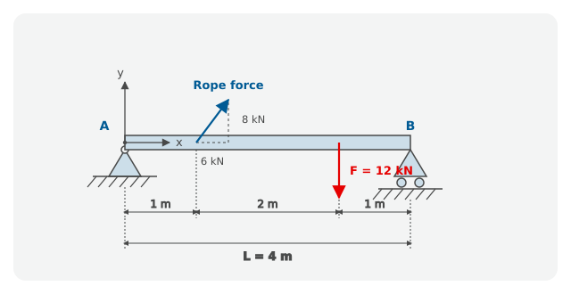

---
kernelspec:
  name: python3
  display_name: 'Python 3'
---

# 3.2 Support Reactions of a Beam

In Chapter 3.1 we wrote a system of equations as a matrix equation, checked
its solvability, and solved it with `np.linalg.solve`. In this chapter we
apply the same approach to a problem from engineering mechanics: the support
reactions of a loaded beam. Work through the parts in pairs if possible, and
in order, since each part builds on the previous one.

We consider the following beam with a pin support and a roller support, on
which a cable force and a load act.



Beam with pin support and roller support, cable force and load $F$.

## Project: Support reactions of a beam (✩✩)

A horizontal beam of length $L = 4\,\text{m}$ is supported on the left at
point A by a **pin support** and on the right at point B by a **roller
support**. The pin support can carry a horizontal force $A_x$ and a vertical
force $A_y$, the roller support only a vertical force $B_y$. The x-axis
points to the right, the y-axis upward, and the origin is at A.

The beam is loaded by:

* a **cable force** at a distance of $1\,\text{m}$ from A, with components
  $6\,\text{kN}$ to the right and $8\,\text{kN}$ upward,
* a **load** $F = 12\,\text{kN}$ vertically downward at a distance of
  $3\,\text{m}$ from A.

We want to find the three support reactions $A_x$, $A_y$ and $B_y$.

## Part 1: Set up the equilibrium conditions

For a rigid beam, three equilibrium conditions hold: the sum of all
horizontal forces is zero, the sum of all vertical forces is zero, and the
sum of all moments about point A is zero.

Set up the three equations with the numerical values from the project
statement. Use the sign convention: forces to the right and upward are
positive, moments counterclockwise are positive. The cable force acts at
the height of the beam axis, so its horizontal component produces no moment
about A.

```{code-cell} python
# code cell
```

## Part 2: Bring into matrix form and check solvability

Combine the three equations from Part 1 into the matrix equation
$\mathbf{A} \cdot \vec{x} = \vec{b}$, with the vector of unknowns
$\vec{x} = (A_x,\ A_y,\ B_y)^\top$. Create `A` as a two-dimensional array
and `b` as a one-dimensional array, and use the determinant to check
whether the system has a unique solution.

```{code-cell} python
# code cell
```

## Part 3: Solve and check

Solve the system with `np.linalg.solve` and verify the result with a check.
Print the three support reactions in kN.

```{code-cell} python
# code cell
```

## Part 4: Interpret the result

Answer in your own words:

1. What does the negative sign of $A_x$ mean for the direction of the
   horizontal support reaction?
2. $A_y$ is also negative. In which direction does the vertical support
   reaction at the pin support point, and how does that fit with the cable
   force acting on the beam?

## Closing question

Suppose that at A there were a roller support instead of the pin support,
one that can only carry a vertical force **upward** (it can push, but not
pull). What would happen to the beam? Use your result from Part 3.

## Bonus exercise: A beam without horizontal restraint (✩✩✩)

Now **both** supports are roller supports that can carry only vertical
forces. There are therefore only two unknown support reactions, $A_y$ and
$B_y$, but still three equilibrium conditions. The loading stays unchanged.

1. Write the three equations with the two unknowns as
   $\mathbf{A} \cdot \vec{x} = \vec{b}$. The matrix `A` then has three rows
   and two columns.
2. Try to solve the system with `np.linalg.solve`. What does Python report?
3. Consider the first equation ($\sum F_x = 0$) on its own. Can it be
   satisfied?
4. Explain physically why this beam cannot be in equilibrium.

```{code-cell} python
# code cell
```

