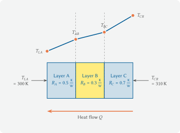

---
kernelspec:
  name: python3
  display_name: 'Python 3'
---

# 3.3 Heat Transfer Through a Multilayer Wall

In Chapter 3.1 we solved linear systems of equations with NumPy, and in
Chapter 3.2 we computed the support reactions of a beam. Both times we set up
the equations by hand. Now we apply the same tool to a classic mechanical
engineering problem: an exterior wall made of three layers with different
thermal resistances. *What is the temperature at the interfaces, and how
large is the heat flow?*

We will see that the path from the physical equations to the matrix is
always the same: all unknowns on the left-hand side, all known quantities on
the right.

## The physical model

We consider a wall made of three layers A, B, C with thermal resistances
$R_A$, $R_B$, $R_C$ in K/W. On the left the temperature is $T_{LA}$, on the
right $T_{CR}$.



Temperature profile of a multilayer wall in the steady state (schematic
representation with equal geometric layer thickness). Since the heat flow
through all layers is the same, the slope of the temperature profile is
proportional to the thermal resistance of each layer, steepest in layer C
and flattest in layer B. (Source: own figure; license [CC BY-SA
4.0](https://creativecommons.org/licenses/by-sa/4.0))

In the **steady state** the heat flow $Q$ is the same through all layers.
The **heat transfer law**, analogous to Ohm's law, reads for each layer

$$Q = \frac{\Delta T_i}{R_i},$$

where $\Delta T_i$ is the temperature difference across the layer. With the
two unknown interface temperatures $T_{AB}$, $T_{BC}$ and the unknown heat
flow $Q$, this gives three equations:

$$\frac{T_{LA} - T_{AB}}{R_A} = Q \qquad (1)$$

$$\frac{T_{AB} - T_{BC}}{R_B} = Q \qquad (2)$$

$$\frac{T_{BC} - T_{CR}}{R_C} = Q \qquad (3)$$

## From the equations to matrix form

The three equations contain the unknowns in fractions. We bring all
unknowns to the left-hand side by multiplying each equation by $R_i$ and
rearranging:

$$T_{AB} + R_A \cdot Q = T_{LA} \qquad (1')$$

$$-T_{AB} + T_{BC} + R_B \cdot Q = 0 \qquad (2')$$

$$-T_{BC} + R_C \cdot Q = -T_{CR} \qquad (3')$$

Now we read off the coefficient matrix row by row. The solution vector is
$\vec{x} = (T_{AB},\ T_{BC},\ Q)^\top$:

$$\begin{pmatrix}
+1 &  0 & R_A \\
-1 & +1 & R_B \\
 0 & -1 & R_C
\end{pmatrix}
\cdot
\begin{pmatrix} T_{AB} \\ T_{BC} \\ Q \end{pmatrix}
=
\begin{pmatrix} T_{LA} \\ 0 \\ -T_{CR} \end{pmatrix}$$

Each rearranged equation gives one row of $\mathbf{A}$ and one entry in
$\vec{b}$. The coefficient of the $j$-th unknown in the $i$-th equation sits
in $A_{ij}$. Unknowns that do not appear in an equation get the coefficient
0.

## Implementation and solution

```{code-cell} python
import numpy as np

# given quantities
R_A = 0.5    # thermal resistance layer A in K/W
R_B = 0.3    # thermal resistance layer B in K/W
R_C = 0.7    # thermal resistance layer C in K/W
T_LA = 293.0    # temperature left side (inside) in K
T_CR = 273.0    # temperature right side (outside) in K

# coefficient matrix, unknowns x = [T_AB, T_BC, Q]
A = np.array([
    # TODO: ???   equation (1'):  T_AB + R_A*Q = T_LA
    # TODO: ???   equation (2'): -T_AB + T_BC + R_B*Q = 0
    # TODO: ???   equation (3'): -T_BC + R_C*Q = -T_CR
])

# TODO: ???   right-hand side b from equations (1')-(3')

# check solvability
# TODO: ???   compute the determinant of A
print(f'Determinant: {det_A:.4f}')

# solve
# TODO: ???   solve A @ x = b for x
T_AB, T_BC, Q = x   # unpack the result into three variables

print(f'T_AB = {T_AB:.2f} K   (interface A-B)')
print(f'T_BC = {T_BC:.2f} K   (interface B-C)')
print(f'Q    = {Q:.4f} W   (heat flow)')

print('Check passed:', np.allclose(A @ x, b))
```

The heat flow $Q$ is positive. This matches our setup: the positive
direction points from left to right, and heat flows from the warmer left
side ($T_{LA} = 293$ K) to the colder right side ($T_{CR} = 273$ K). A
negative value would mean that the heat flows in the other direction.

As a check, we compute the temperature difference across each layer. Layer
C has the largest resistance and should therefore show the largest
temperature jump, just as the largest resistance in an electrical circuit
produces the largest voltage drop.

```{code-cell} python
# TODO: ???   temperature differences delta_A, delta_B, delta_C across each layer

print(f'Temperature difference layer A (R = {R_A} K/W): {delta_A:.2f} K')
print(f'Temperature difference layer B (R = {R_B} K/W): {delta_B:.2f} K')
print(f'Temperature difference layer C (R = {R_C} K/W): {delta_C:.2f} K')
print(f'Sum: {delta_A + delta_B + delta_C:.2f} K '
      f'(must equal T_CR - T_LA = {T_CR - T_LA:.1f} K)')
```

## Summary and outlook

The approach is always the same: rearrange the physical balance equations,
move all unknowns to the left, all known quantities to the right, then read
off $\mathbf{A}$ and $\vec{b}$ row by row. `np.linalg.solve` provides the
solution, `np.allclose` verifies it, and we interpret the sign of the result
through the chosen direction convention.

In the next chapter we extend this example: we add a fourth layer to the
wall and use a parameter study to investigate how much additional
insulation reduces the heat flow.

## Mini-exercises

### Mini-exercise 1

1. Answer without code: why is the heat flow $Q$ the same in all three
   layers in the steady state? What would it mean if $Q$ in layer B were
   larger than in layer A?
2. For a single wall without intermediate layers,
   $Q = (T_{LA} - T_{CR}) / R_\text{total}$ with
   $R_\text{total} = R_A + R_B + R_C$. Compute this value for
   $R_A = 0.5$, $R_B = 0.3$, $R_C = 0.7$ (all in K/W), $T_{LA} = 293$ K and
   $T_{CR} = 273$ K.

```{code-cell} python
# code cell
```

### Mini-exercise 2

Answer without code:

1. In the coefficient matrix, row 2, column 1 holds the value $-1$. Which
   equation does this entry come from, and why is it negative?
2. Why is the second entry of the right-hand side, $b[1]$, equal to zero?
   What does that mean physically?

```{code-cell} python
# code cell
```

### Mini-exercise 3

A cold-storage wall keeps the inside at $T_\text{inside} = 268$ K (−5 °C),
while outside it is $T_\text{outside} = 293$ K (20 °C). The left side is the
inside ($T_{LA} = T_\text{inside}$), the right side the outside
($T_{CR} = T_\text{outside}$).

| Layer | Material | $R$ in K/W |
| --- | --- | --- |
| A | Concrete | 0.2 |
| B | Polyurethane foam | 1.8 |
| C | Sheet steel | 0.05 |

1. Answer without code: which layer will have the largest temperature drop?
2. Set up `A` and `b` with the new values, solve the system, and print
   $T_{AB}$, $T_{BC}$ and $Q$.
3. The heat flow comes out negative. Why?

```{code-cell} python
# code cell
```
